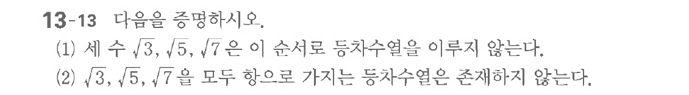

# 연습문제 13-13

## 문제

$\sqrt{3}, \sqrt{5}, \sqrt{7}$ 다음 수를 정하여시오.
(1) 세 수 $\sqrt{3}, \sqrt{5}, \sqrt{7}$은 순서로 존재하지 않는다.
(2) $\sqrt{3}, \sqrt{5}, \sqrt{7}$을 모두 항으로 가지는 등장수열은 존재하지 않는다.

## 원문 문제

## 원문

