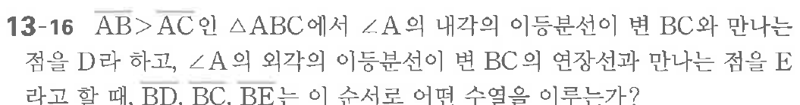

# 연습문제 13-16

## 문제

$\overline{AB}>\overline{AC}$인 $\triangle ABC$에서 $\angle A$의 내각의 이등분선이 변 $BC$와 만나는 점을 $D$라고 하고, $\angle A$의 외각의 이등분선이 변 $BC$의 연장선과 만나는 점을 $E$라고 할 때, $\overline{BD}$, $\overline{BC}$, $\overline{BE}$는 이 순서로 어떤 수열을 이루는가?

## 원문 문제

## 원문

