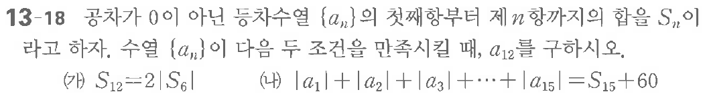

# 연습문제 13-18

## 문제

공차가 $0$이 아닌 등차수열 $\{a_n\}$의 첫째항부터 제 $n$항까지의 합을 $S_n$이라고 하자. 수열 $\{a_n\}$이 다음 두 조건을 만족시킬 때, $a_{12}$를 구하시오.

$$
\text{(가) } S_{12}=2|S_6|
$$

$$
\text{(나) } |a_1|+|a_2|+|a_3|+\cdots+|a_{15}|=S_{15}+60
$$

## 원문 문제

## 원문

