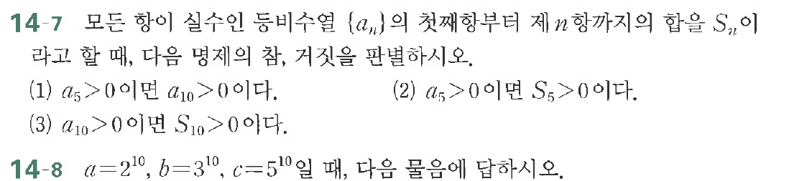

# 연습문제 14-7

## 문제

모든 항이 실수인 등비수열 $\{a_n\}$의 첫째항부터 제 $n$ 항까지의 합을 $S_n$이라고 할 때, 다음 명제의 참/거짓을 판별하시오.
(1) $a_5 > 0$이면 $a_{10} > 0$이다.
(2) $a_5 > 0$이면 $S_5 > 0$이다.
(3) $a_{10} > 0$이면 $S_{10} > 0$이다.

연습문제 14-8

$a=2^{10}$, $b=3^{10}$, $c=5^{10}$일 때, 다음 물음에 답하시오.

## 원문 문제

## 원문

