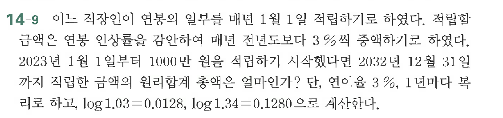

# 연습문제 14-9

## 문제

어는 직장인이 연봉의 일부를 매년 1월 입부터 매년 1월 입부더 적립하기 시작했다면 2032년 12월 31일 까지 적립한 금액의 원리합계는 얼마인가? 적립할 금액은 연봉 인상률을 감안하여 매년도 받아 $3\%$로 하고, $\log$로 하고, $\log 1.03=0.0128$, $\log 1.34=0.1280$으로 계산한다.

## 원문 문제

## 원문

