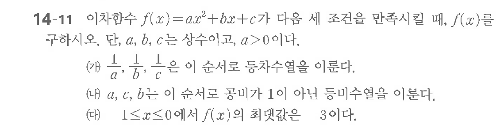

# 연습문제 14-11

## 문제

이차함수 $f(x) = ax^2 + bx + c$가 다음 식을 만족시킬 때, $f(x)$를 구하시오. 단, $a, b, c$는 상수이고, $a > 0$이다.

(가) $\frac{1}{a}, \frac{1}{b}, \frac{1}{c}$은 이 순서로 등장수열을 이룬다.

(나) $a, b, c$는 이 순서로 공비가 1인 등비수열을 이룬다.

(다) $-1 \le x \le 0$에서 $f(x)$의 최댓값은 $-3$이다.

## 원문 문제

## 원문

