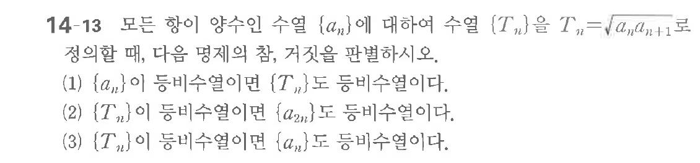

# 연습문제 14-13

## 문제

모든 항이 양수인 수열 $\{a_n\}$에 대하여 $T_n = \sqrt{a_n} + 1$로 정의할 때, 다음 명제의 참, 거짓을 판별하시오.
(1) $\{a_n\}$이 등비수열이면 $T_n$도 등비수열이다.
(2) $\{T_n\}$이 등비수열이면 $\{a_n\}$도 등비수열이다.
(3) $\{T_n\}$이 등비수열이면 $\{a_n\}$도 등비수열이다.

## 원문 문제

## 원문

