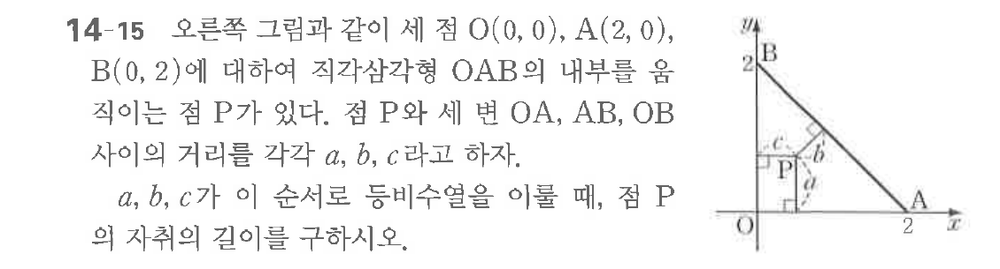

# 연습문제 14-15

## 문제

점 $\text{O}$를 원점과 같이 $\text{점 A}(2, 0)$, $\text{B}(0, 2)$에 대하여 직각삼각형 $\text{OAB}$의 내부를 옴 지나는 점 $\text{P}$가 있다.
점 $\text{P}$와 세 변 $\text{OA}$, $\text{OB}$ 사이의 거리를 각각 $a$, $b$, $c$라고 하자.
$\text{a}$, $\text{b}$, $\text{c}$가 이 순서로 등비수열이므로, 점 $\text{P}$의 자취의 길이를 구하시오.

## 원문 문제

## 원문

