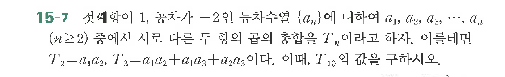

# 연습문제 15-7

## 문제

$a_1, a_2, a_3, \dots, a_n$이 존재하여 $a_1, a_2, a_3, \dots, a_n$에 대하여
$T_2 = a_1 a_2, T_3 = a_1 a_2 + a_3 + a_2 a_3, \dots, a_n$
$(n \ge 2)$ 중에서 다른 두 항의 합의 총합을 $T_n$이라고 하자. 이로부터
$T_2 = a_1 a_2, T_3 = a_1 a_2 + a_3 + a_2 a_3$이다. 이때, $T_{10}$의 값을 구하시오.

## 원문 문제

## 원문

