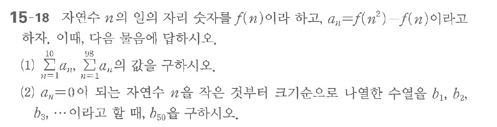

# 연습문제 15-18

## 문제

$a_n$의 자리를 $f(n)$이라 쓴다, $a_n = f(n^2)$이라고 하자.

(1) $\sum_{n=1}^{98} a_n$, $\sum_{n=1}^{98} f(n)$을 구하시오.

(2) $a_n=0$이 되는 자연수 $n$을 둔부터 크기순으로 나열한 수열 $b_1, b_2, b_3, \dots$이라고 할 때, $b_{50}$을 구하시오.

## 원문 문제

## 원문

