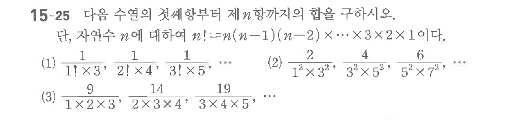

# 연습문제 15-25

## 문제

다음 수열의 첫째항부터 $n$항까지의 합을 구하시오.

(1) $\frac{1}{1! \times 3'} \frac{1}{2! \times 4'} \frac{1}{3! \times 5'} \cdots$
(2) $\frac{1^2 \times 3^2}{3^2 \times 5^2} \frac{3^2 \times 5^2}{5^2 \times 7^2} \cdots$
(3) $\frac{9}{1 \times 2 \times 3'} \frac{14}{2 \times 3 \times 4'} \frac{19}{3 \times 4 \times 5'} \cdots$

## 원문 문제

## 원문

