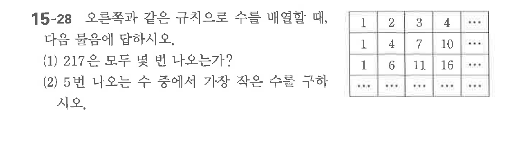

# 연습문제 15-28

## 문제

오른쪽과 같은 규칙으로 수들을 배열할 때,
(1) 217은 모두 몇 번 나오는가?
(2) 5번 나오는 수 중에서 가장 작은 수를 구하시오.

$$\begin{array}{cccc} 1 & 2 & 3 & 4 & \cdots \\ 1 & 4 & 7 & 10 & \cdots \\ 1 & 6 & 11 & 16 & \cdots \end{array}$$

## 원문 문제

## 원문

