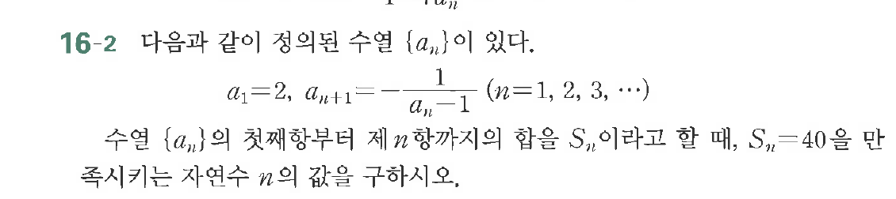

# 연습문제 16-2

## 문제

다음 값이 정된 수열 $\{a_n\}$이 있다.
$$a_1 = 2, \quad a_{n+1} = \frac{1}{a_n - 1} \quad (n=1, 2, 3, \dots)$$
수열 $\{a_n\}$의 첫째항부터 제 $n$ 항까지의 합을 $S_n$이라고 할 때, $S_n = 40$을 만족시키는 자연수 $n$의 값을 구하시오.

## 원문 문제

## 원문

