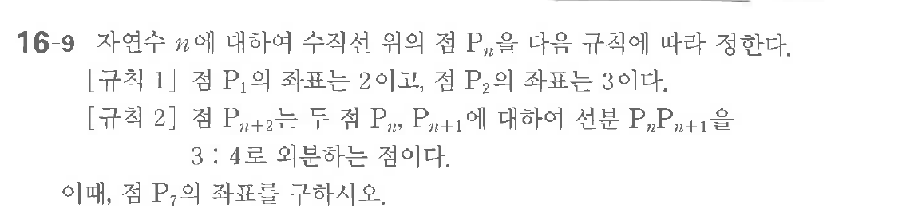

# 연습문제 16-9

## 문제

$n$에 대하여 수직선 위의 점 $P_n$을 다음 규칙에 정한다.
[규칙 1] 점 $P_1$의 좌표는 2이고, 점 $P_2$의 좌표는 3이다.
[규칙 2] 점 $P_{n+2}$는 두 점 $P_n, P_{n+1}$에 대하여 선분 $P_n P_{n+1}$에 대하여 선분 $P_{n+2}$를 4로 의분한다.

이제, 점 $P_7$의 좌표를 구하시오.

## 원문 문제

## 원문

