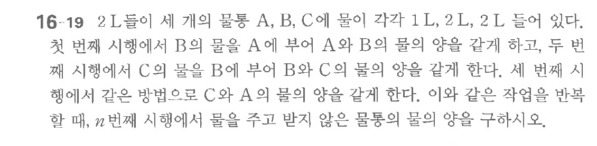

# 연습문제 16-19

## 문제

2L들이 세 개의 물통 A, B, C에 물이 각각 1L, 2L, 2L 들어 있다.
첫 번째 시행에서 B 물을 A에 $a$와 B 물의 양을 같게 하고, 두 번째 시행에서 C 물의 양을 B 물의 양과 C 물의 양을 같게 한다. 세 번째 시행에서 같은 방법으로 C와 A 물의 양을 같게 한다. 이와 같은 방법으로 $n$ 번째 시행에서 물을 주고 받지 않으면서 C의 물의 양을 구하시오.

## 원문 문제

## 원문

