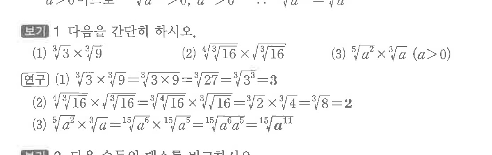
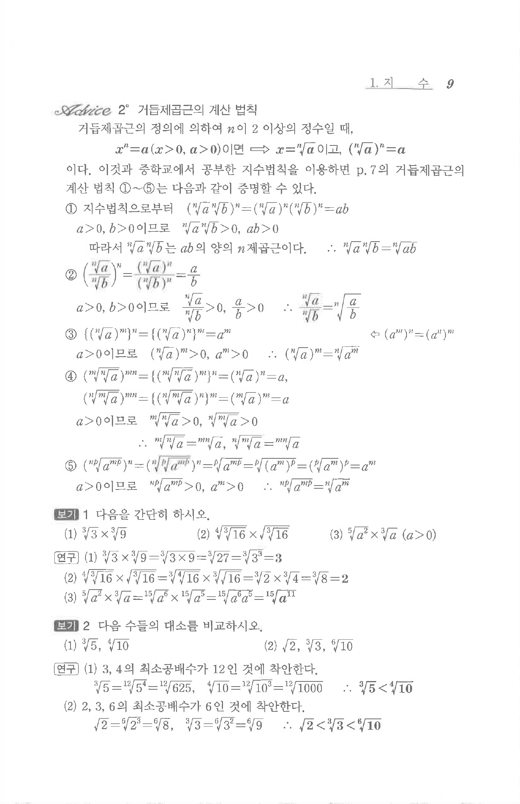

# S1 보기 1

## 문제

다음을 간단히 하시오.

(1) $\sqrt[3]{3}\times\sqrt[3]{9}$

(2) $\sqrt[4]{\sqrt[3]{16}}\times\sqrt{\sqrt[3]{16}}$

(3) $\sqrt[5]{a^2}\times\sqrt[3]{a}\quad(a>0)$

## 정답

(1) $3$  
(2) $2$  
(3) $\sqrt[15]{a^{11}}$

## 원문 문제

## 원문

