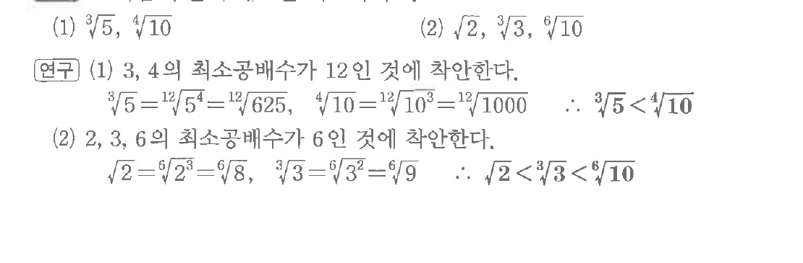

# S1 보기 2

## 문제

다음 수들의 대소를 비교하시오.

(1) $\sqrt[3]{5},\ \sqrt[4]{10}$

(2) $\sqrt{2},\ \sqrt[3]{3},\ \sqrt[6]{10}$

## 정답

(1) $\sqrt[3]{5}<\sqrt[4]{10}$  
(2) $\sqrt{2}<\sqrt[3]{3}<\sqrt[6]{10}$

## 원문 문제

## 원문

