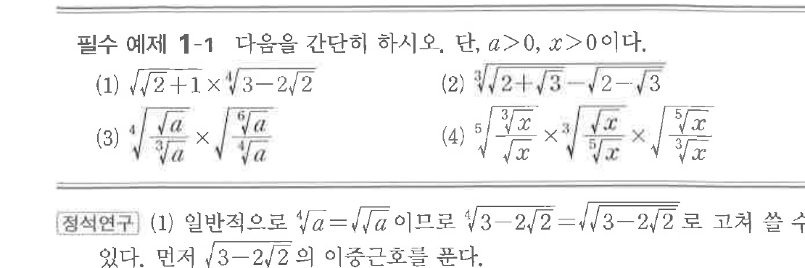
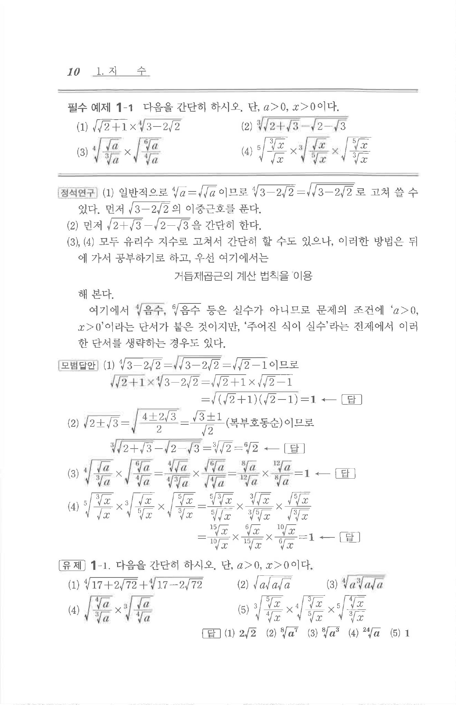

# 필수 예제 1-1

## 문제

다음을 간단히 하시오. 단, $a>0$, $x>0$이다.

(1) $\sqrt{\sqrt{2}+1}\times\sqrt[4]{3-2\sqrt{2}}$

(2) $\sqrt[3]{\sqrt{2+\sqrt{3}}-\sqrt{2-\sqrt{3}}}$

(3) $\sqrt[4]{\dfrac{\sqrt{a}}{\sqrt[3]{a}}}\times\sqrt{\dfrac{\sqrt[6]{a}}{\sqrt[4]{a}}}$

(4) $\sqrt[5]{\dfrac{\sqrt[3]{x}}{\sqrt{x}}}\times\sqrt[3]{\dfrac{\sqrt{x}}{\sqrt[5]{x}}}\times\sqrt{\dfrac{\sqrt[5]{x}}{\sqrt[3]{x}}}$

## 정답

(1) $1$  
(2) $\sqrt[6]{2}$  
(3) $1$  
(4) $1$

## 원문 문제

## 원문

