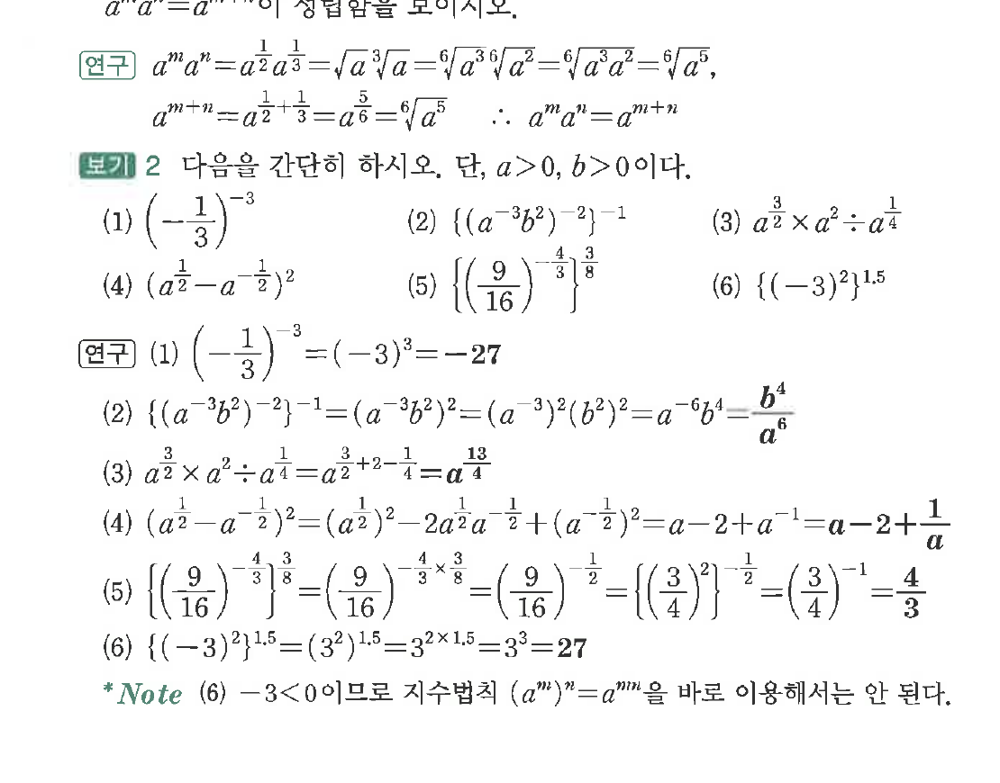
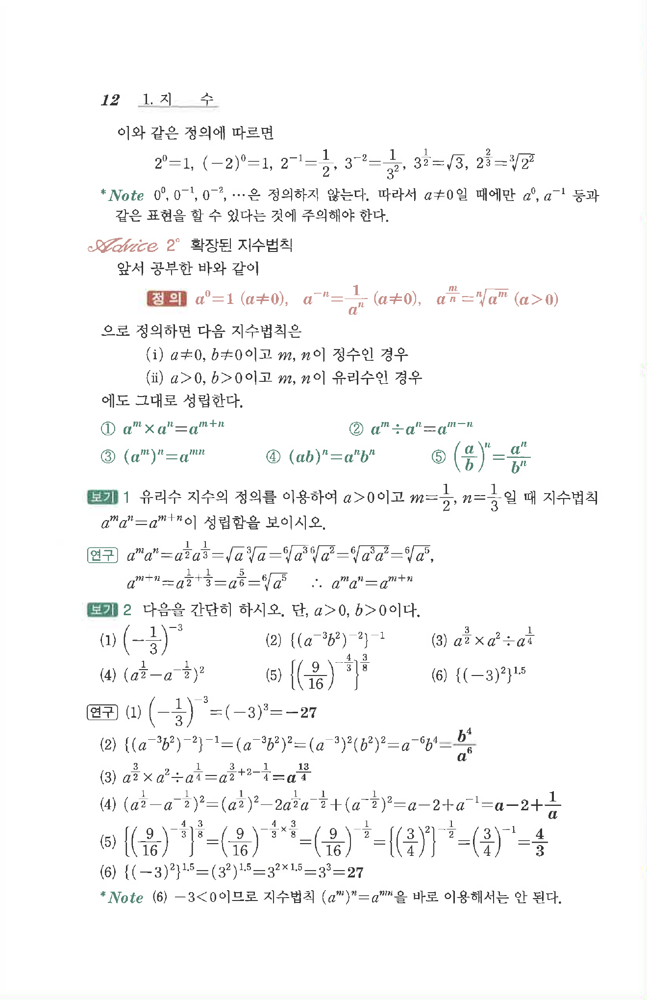

# S2 보기 2

## 문제

다음을 간단히 하시오. 단, $a>0$, $b>0$이다.

(1) $\left(-\dfrac13\right)^{-3}$

(2) $\left\{(a^{-3}b^2)^{-2}\right\}^{-1}$

(3) $a^{\frac32}\times a^2\div a^{\frac14}$

(4) $(a^{\frac12}-a^{-\frac12})^2$

(5) $\left\{\left(\dfrac{9}{16}\right)^{-\frac43}\right\}^{\frac38}$

(6) $\left\{(-3)^2\right\}^{1.5}$

## 정답

(1) $-27$  
(2) $\dfrac{b^4}{a^6}$  
(3) $a^{\frac{13}{4}}$  
(4) $a-2+\dfrac1a$  
(5) $\dfrac43$  
(6) $27$

## 원문 문제

## 원문

