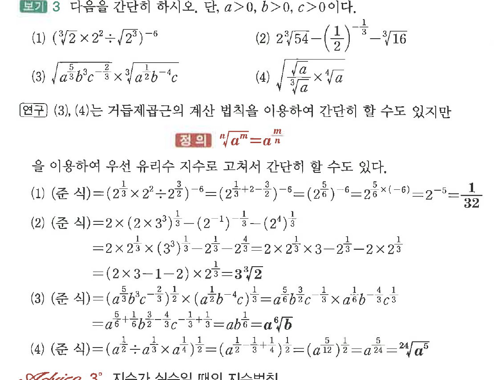
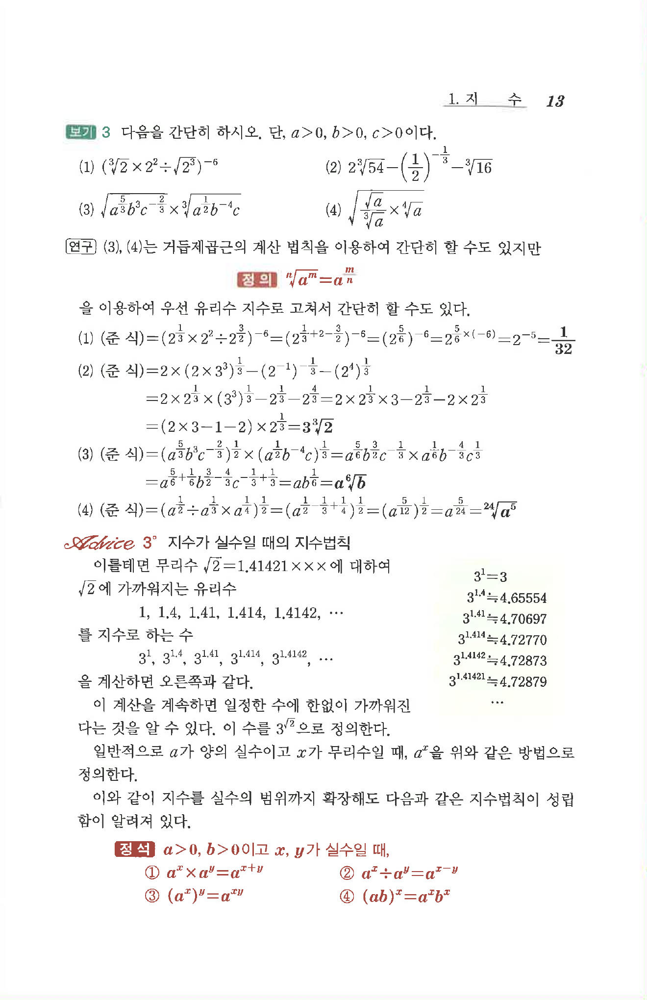

# S2 보기 3

## 문제

다음을 간단히 하시오. 단, $a>0$, $b>0$, $c>0$이다.

(1) $\left(\sqrt[3]{2}\times 2^2\div\sqrt{2^3}\right)^{-6}$

(2) $2\sqrt[3]{54}-\left(\dfrac12\right)^{-\frac13}-\sqrt[3]{16}$

(3) $\sqrt{a^{\frac53}b^3c^{-\frac23}}\times\sqrt[3]{a^{\frac12}b^{-4}c}$

(4) $\sqrt{\dfrac{\sqrt{a}}{\sqrt[3]{a}}\times\sqrt[4]{a}}$

## 정답

(1) $\dfrac1{32}$  
(2) $3\sqrt[3]{2}$  
(3) $a\sqrt[6]{b}$  
(4) $\sqrt[24]{a^5}$

## 원문 문제

## 원문

