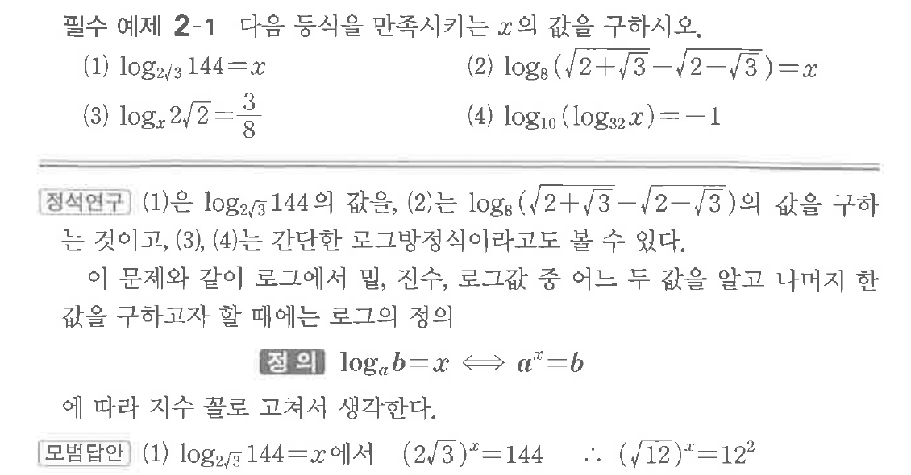

# 필수 예제 2-1

## 문제

다음 등식을 만족시키는 $x$의 값을 구하시오.

(1) $\log_{2\sqrt3}144=x$
(2) $\log_8(\sqrt{2+\sqrt3}-\sqrt{2-\sqrt3})=x$
(3) $\log_x 2\sqrt{2} = \frac{3}{8}$
(4) $\log_{10} (\log_{32} x) = -1$

## 원문 문제

## 원문

