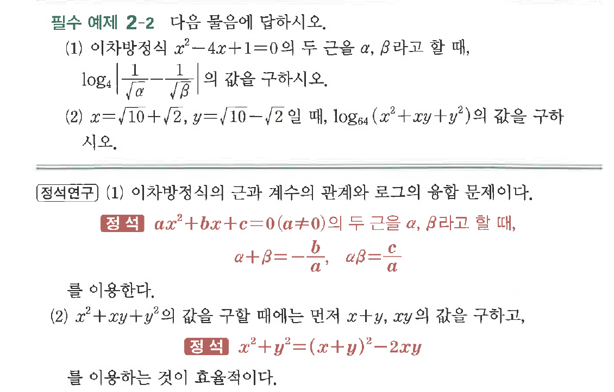
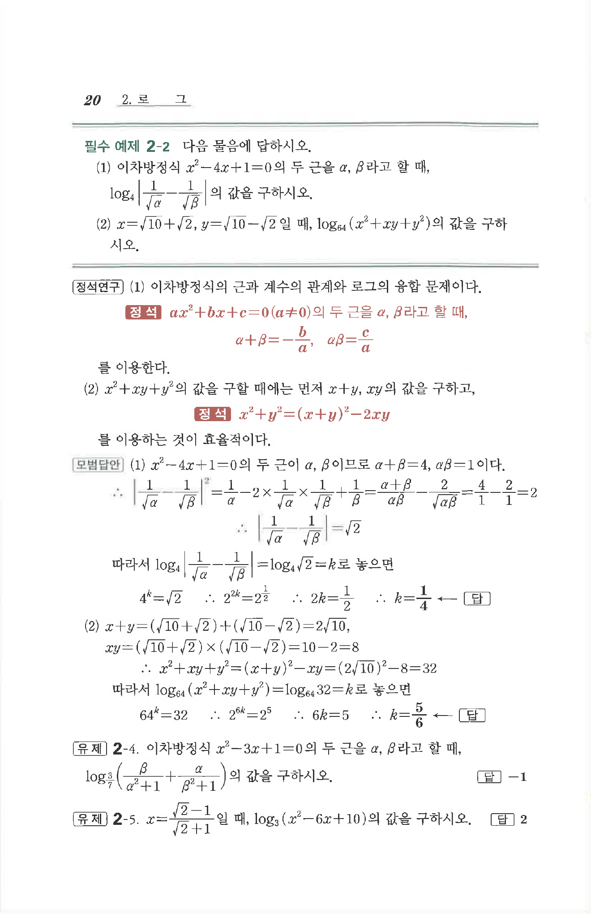

# 필수 예제 2-2

## 문제

다음 물음에 답하시오.

(1) 이차방정식 $x^2-4x+1=0$의 두 근을 $\alpha,\ \beta$라고 할 때,

$$
\log_4\left|\dfrac1{\sqrt\alpha}-\dfrac1{\sqrt\beta}\right|
$$

의 값을 구하시오.

(2) $x=\sqrt{10}+\sqrt2,\ y=\sqrt{10}-\sqrt2$일 때, $\log_{64}(x^2+xy+y^2)$의 값을 구하시오.

## 원문 문제

## 원문

