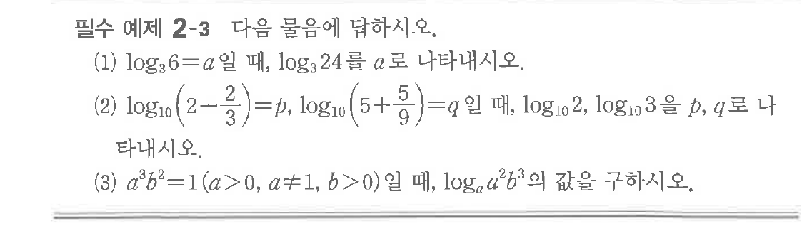
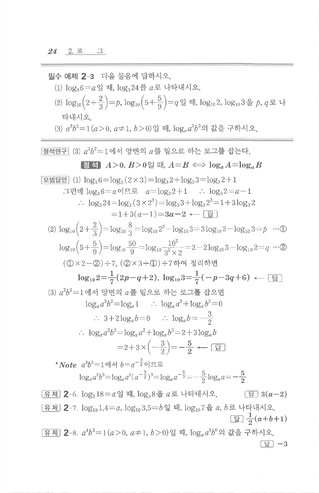

# 필수 예제 2-3

## 문제

(1) $\log_{3} 6 = a$일 때, $\log_{3} 24$를 $a$로 나타내시오.
(2) $\log_{10}\left(2 + \frac{2}{3}\right) = p$, $\log_{10}\left(5 + \frac{5}{9}\right) = q$일 때, $\log_{10} 2, \log_{10} 3$을 $p, q$로 나타내시오.
(3) $a^3 b^2 = 1(a > 0, a \neq 1, b > 0)$일 때, $\log_{a} a^2 b^3$의 값을 구하시오.

## 원문 문제

## 원문

