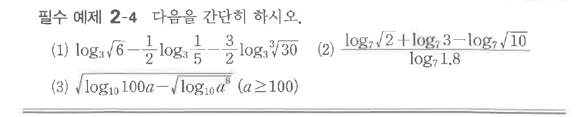
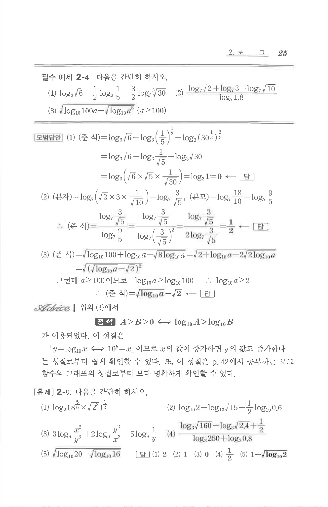

# 필수 예제 2-4

## 문제

다음을 간단히 하시오.

(1) $\log_3 \sqrt{6}-\dfrac{1}{2}\log_3 \dfrac{1}{5}-\dfrac{3}{2}\log_3 \sqrt[3]{30}$

(2) $\dfrac{\log_7 \sqrt{2}+\log_7 3-\log_7 \sqrt{10}}{\log_7 1.8}$

(3) $\sqrt{\log_{10}100a-\sqrt{\log_{10}a^8}}\quad(a \ge 100)$

## 원문 문제

## 원문

