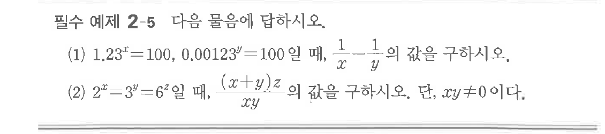

# 필수 예제 2-5

## 문제

다음 물음에 답하시오.

(1) $1.23^x=100$, $0.00123^y=100$일 때, $\dfrac{1}{x}-\dfrac{1}{y}$의 값을 구하시오.

(2) $2^x=3^y=6^z$일 때, $\dfrac{(x+y)z}{xy}$의 값을 구하시오. 단, $xy \ne 0$이다.

## 원문 문제

## 원문

