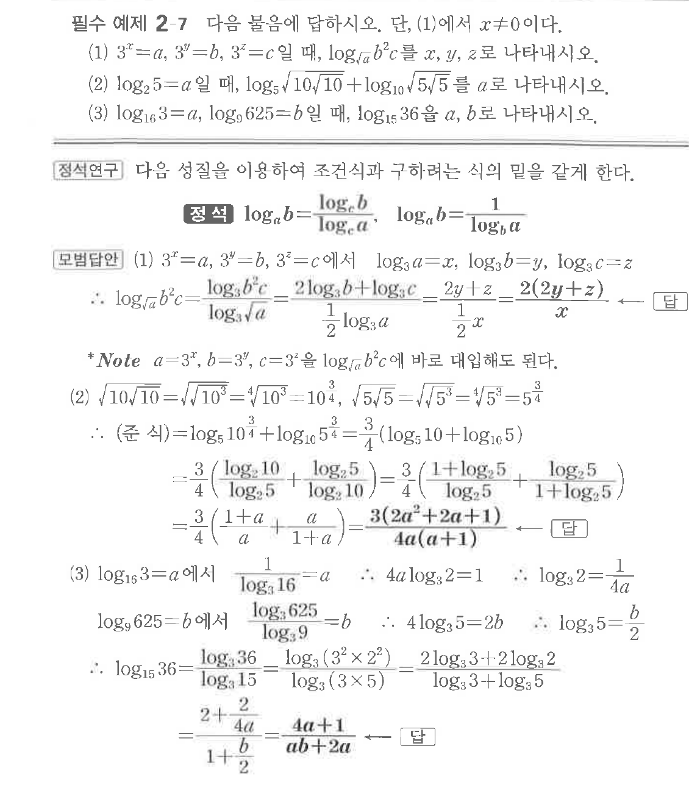

# 필수 예제 2-7

## 문제

다음 물음에 답하시오. 단, (1)에서 $x \ne 0$이다.

(1) $3^x=a$, $3^y=b$, $3^z=c$일 때, $\log_{\sqrt{a}} b^2c$를 $x$, $y$, $z$로 나타내시오.

(2) $\log_2 5=a$일 때, $\log_5 \sqrt{10\sqrt{10}}+\log_{10}\sqrt{5\sqrt{5}}$를 $a$로 나타내시오.

(3) $\log_{16}3=a$, $\log_9 625=b$일 때, $\log_{15}36$을 $a$, $b$로 나타내시오.

## 원문 문제

## 원문

