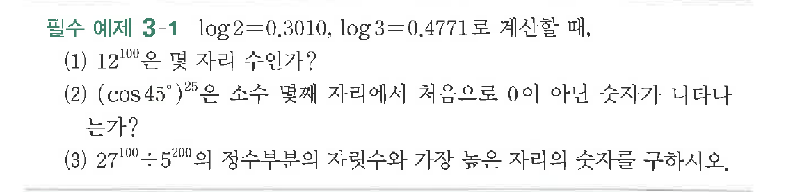
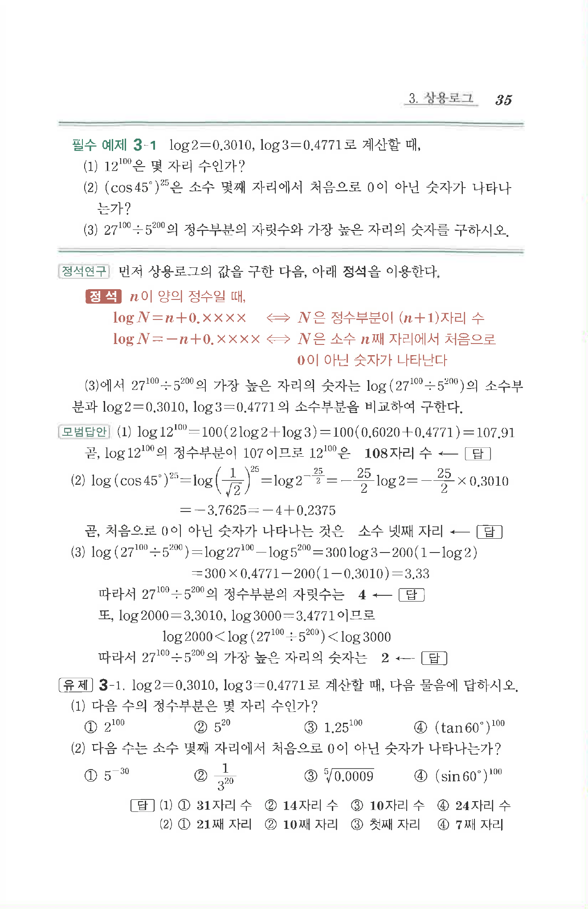

# 필수 예제 3-1

## 문제

$\log 2=0.3010$, $\log 3=0.4771$로 계산할 때,

(1) $12^{100}$은 몇 자리 수인가?

(2) $(\cos45^\circ)^{25}$은 소수 몇째 자리에서 처음으로 $0$이 아닌 숫자가 나타나는가?

(3) $27^{100}\div 5^{200}$의 정수부분의 자릿수와 가장 높은 자리의 숫자를 구하시오.

## 원문 문제

## 원문

