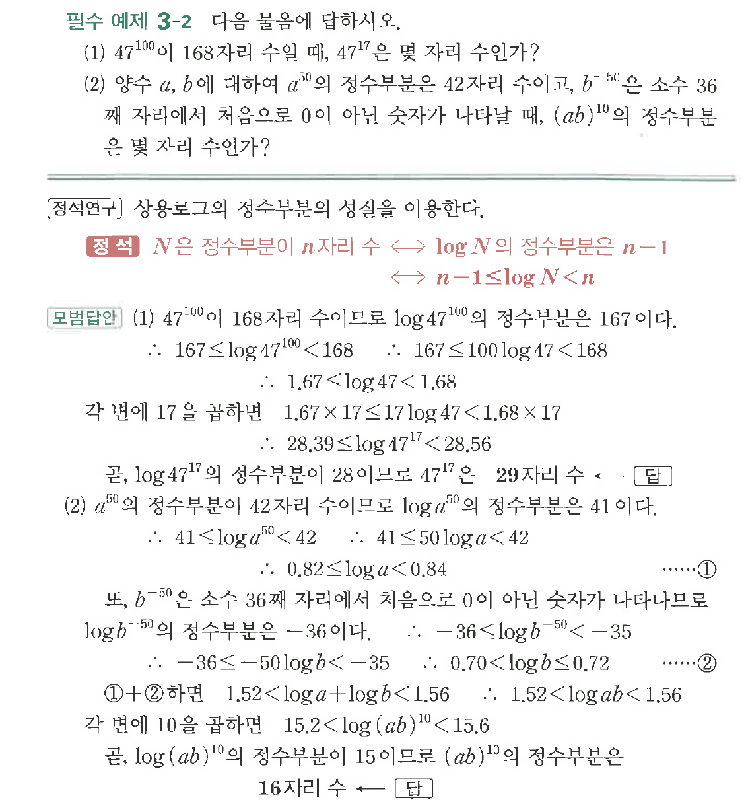
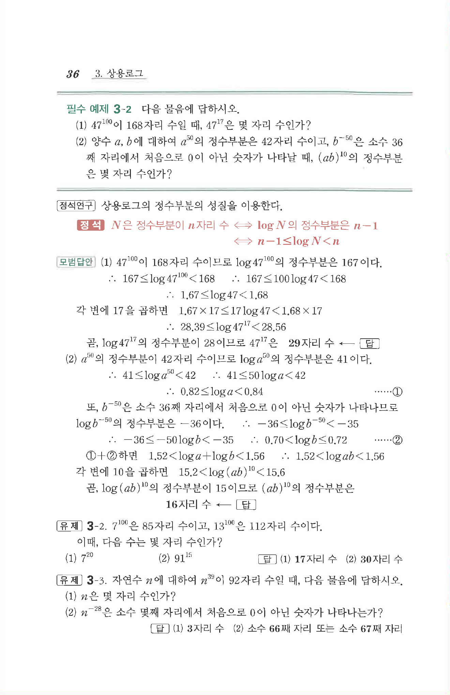

# 필수 예제 3-2

## 문제

다음 물음에 답하시오.

(1) $47^{100}$이 $168$자리 수일 때, $47^{17}$은 몇 자리 수인가?

(2) 양수 $a$, $b$에 대하여 $a^{50}$의 정수부분은 $42$자리 수이고, $b^{-50}$은 소수 $36$째 자리에서 처음으로 $0$이 아닌 숫자가 나타날 때, $(ab)^{10}$의 정수부분은 몇 자리 수인가?

## 원문 문제

## 원문

