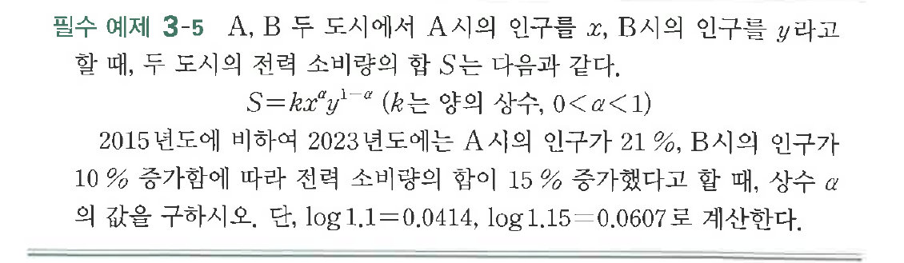
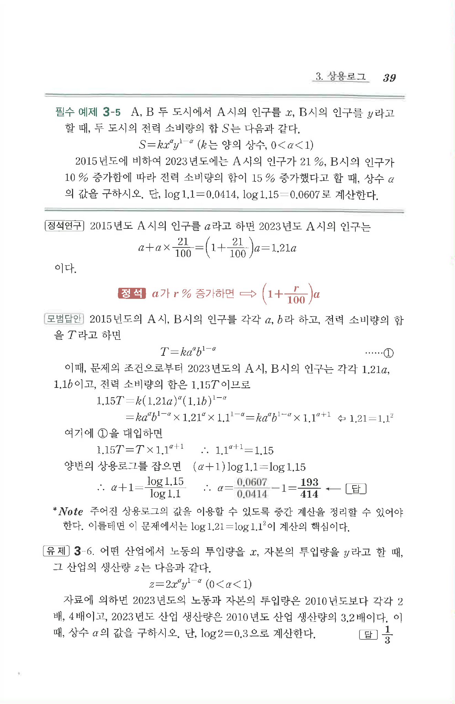

# 필수 예제 3-5

## 문제

$A$, $B$ 두 도시에서 $A$시의 인구를 $x$, $B$시의 인구를 $y$라고 할 때, 두 도시의 전력 소비량의 합 $S$는 다음과 같다.

$$S=kx^\alpha y^{1-\alpha}\quad(k\text{는 양의 상수},\ 0<\alpha<1)$$

$2015$년도에 비하여 $2023$년도에는 $A$시의 인구가 $21\%$, $B$시의 인구가 $10\%$ 증가함에 따라 전력 소비량의 합이 $15\%$ 증가했다고 할 때, 상수 $\alpha$의 값을 구하시오.

단, $\log 1.1=0.0414$, $\log 1.15=0.0607$로 계산한다.

## 원문 문제

## 원문

