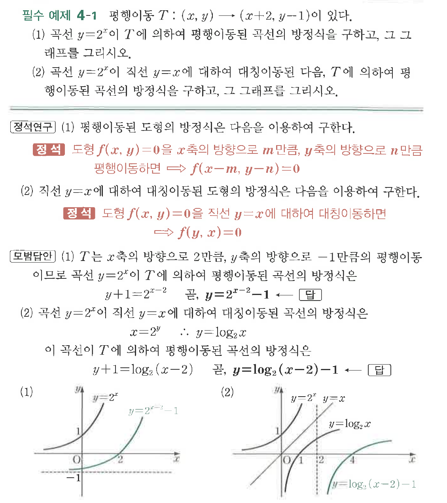
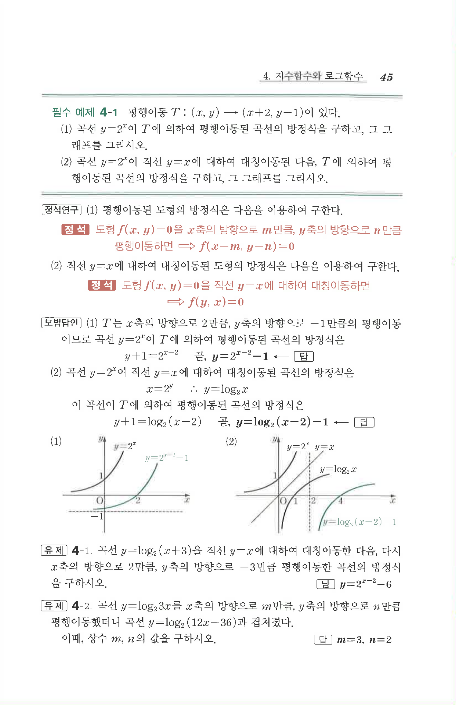

# 필수 예제 4-1

## 문제

평행이동 $T:(x,y)\to(x+2,\ y-1)$이 있다.

(1) 곡선 $y=2^x$이 $T$에 의하여 평행이동된 곡선의 방정식을 구하고, 그 그래프를 그리시오.

(2) 곡선 $y=2^x$이 직선 $y=x$에 대하여 대칭이동된 다음, $T$에 의하여 평행이동된 곡선의 방정식을 구하고, 그 그래프를 그리시오.

## 원문 문제

## 원문

