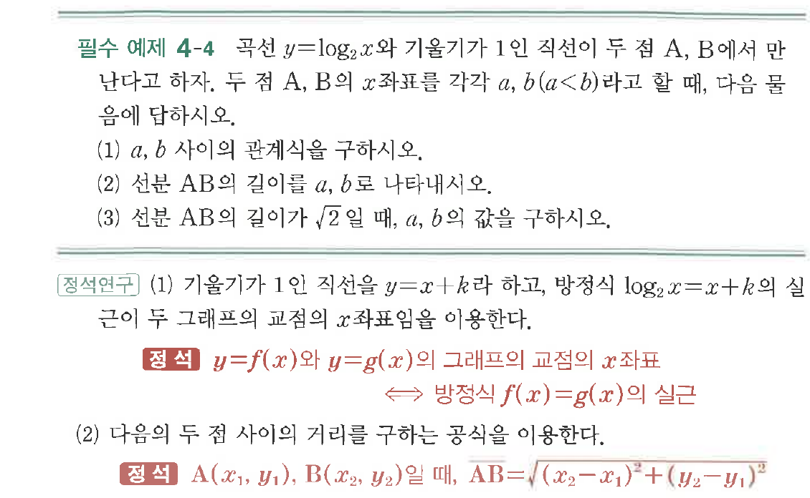

# 필수 예제 4-4

## 문제

곡선 $y=\log_2 x$와 기울기가 $1$인 직선이 두 점 $A$, $B$에서 만난다고 하자. 두 점 $A$, $B$의 $x$좌표를 각각 $a$, $b$($a<b$)라고 할 때, 다음 물음에 답하시오.

(1) $a$, $b$ 사이의 관계식을 구하시오.

(2) 선분 $AB$의 길이를 $a$, $b$로 나타내시오.

(3) 선분 $AB$의 길이가 $\sqrt{2}$일 때, $a$, $b$의 값을 구하시오.

## 원문 문제

## 원문

