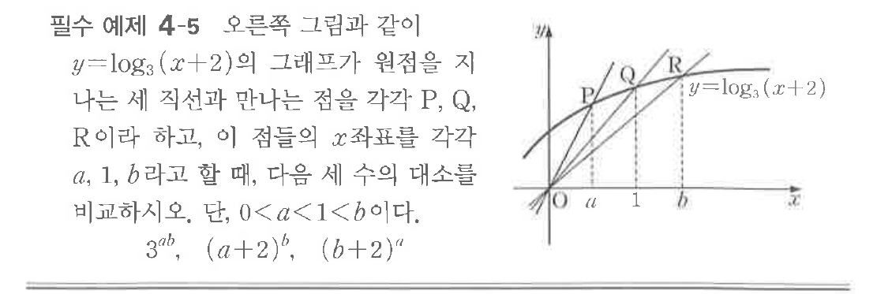
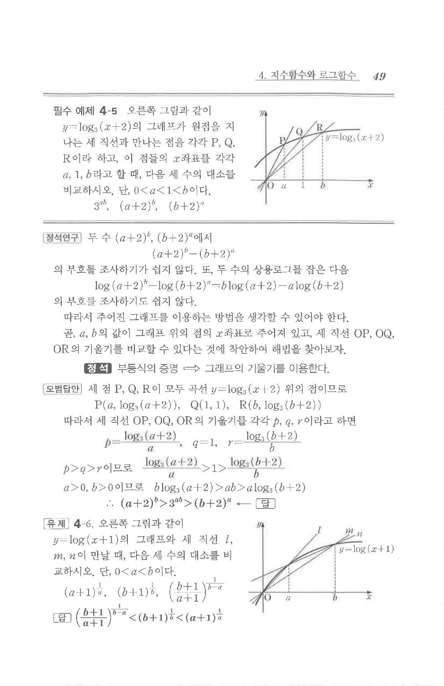

# 필수 예제 4-5

## 문제

오른쪽 그림과 같이 $y=\log_3(x+2)$의 그래프가 원점을 지나는 세 직선과 만나는 점을 각각 $P$, $Q$, $R$이라 하고, 이 점들의 $x$좌표를 각각 $a$, $1$, $b$라고 할 때, 다음 세 수의 대소를 비교하시오. 단, $0<a<1<b$이다.

$$3^{ab},\quad (a+2)^b,\quad (b+2)^a$$

## 원문 문제

## 원문

