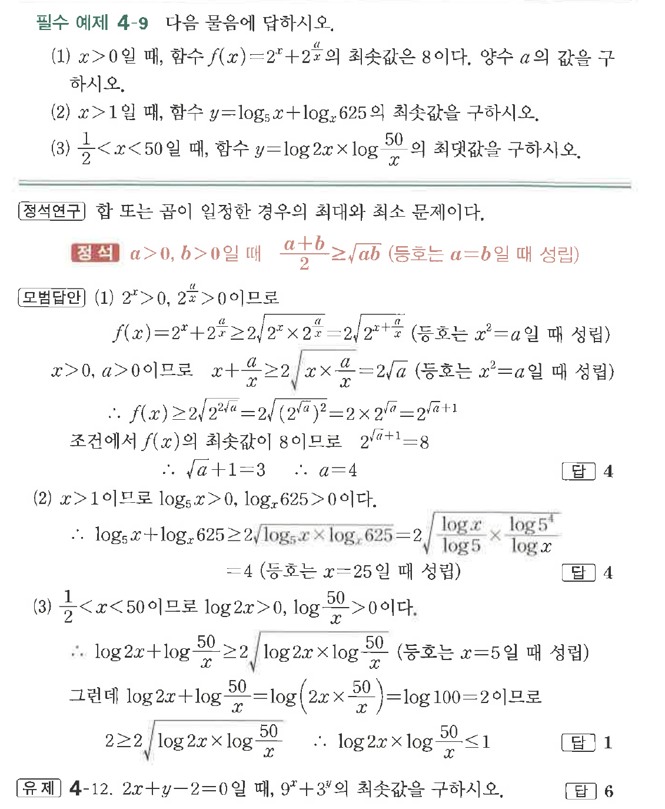

# 필수 예제 4-9

## 문제

다음 물음에 답하시오.

(1) $x>0$일 때, 함수 $f(x)=2^x+2^{\frac{a}{x}}$의 최솟값은 $8$이다. 양수 $a$의 값을 구하시오.

(2) $x>1$일 때, 함수 $y=\log_5 x+\log_x 625$의 최솟값을 구하시오.

(3) $\dfrac{1}{2}<x<50$일 때, 함수 $y=\log 2x \times \log \dfrac{50}{x}$의 최댓값을 구하시오.

## 원문 문제

## 원문

