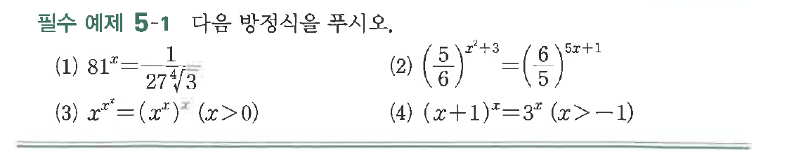

# 필수 예제 5-1

## 문제

다음 방정식을 푸시오.

(1) $81^x=\dfrac{1}{27\sqrt[4]{3}}$

(2) $\left(\dfrac{5}{6}\right)^{x^2+3}=\left(\dfrac{6}{5}\right)^{5x+1}$

(3) $x^{x^x}=(x^x)^x\quad(x>0)$

(4) $(x+1)^x=3^x\quad(x>-1)$

## 원문 문제

## 원문

