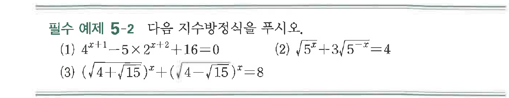
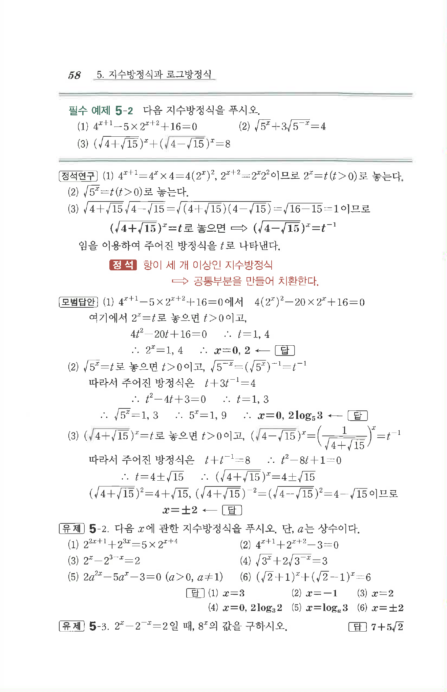

# 필수 예제 5-2

## 문제

다음 지수방정식을 푸시오.

(1) $4^{x+1}-5\times 2^{x+2}+16=0$

(2) $\sqrt{5^x}+3\sqrt{5^{-x}}=4$

(3) $\left(\sqrt{4+\sqrt{15}}\right)^x+\left(\sqrt{4-\sqrt{15}}\right)^x=8$

## 원문 문제

## 원문

