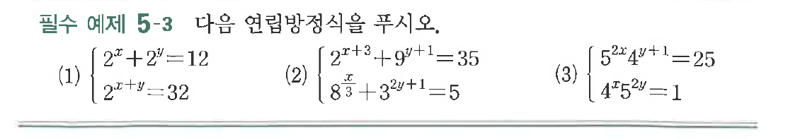
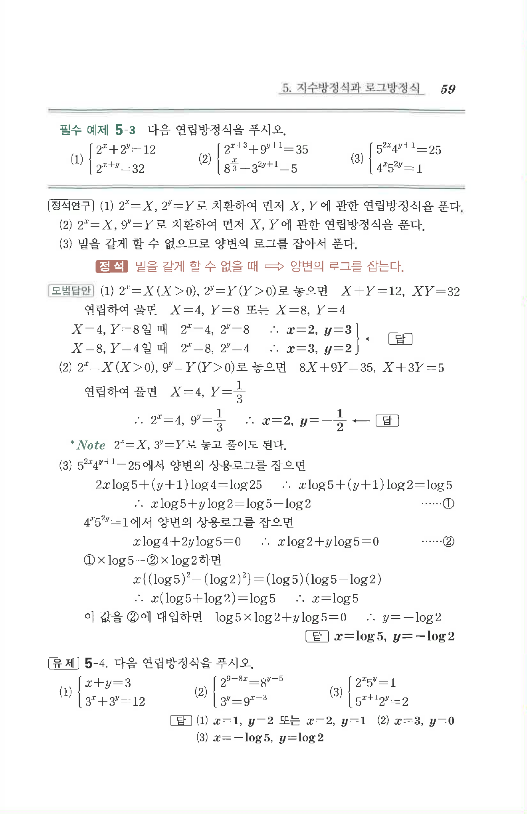

# 필수 예제 5-3

## 문제

다음 연립방정식을 푸시오.

(1) $\begin{cases}2^x+2^y=12\\2^{x+y}=32\end{cases}$

(2) $\begin{cases}2^{x+3}+9^{y+1}=35\\8^{\frac{x}{3}}+3^{2y+1}=5\end{cases}$

(3) $\begin{cases}5^{2x}4^{y+1}=25\\4^x5^{2y}=1\end{cases}$

## 원문 문제

## 원문

