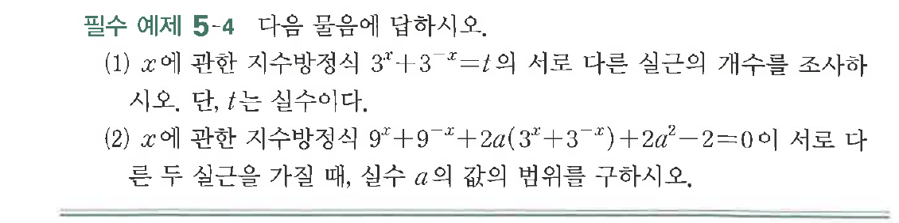
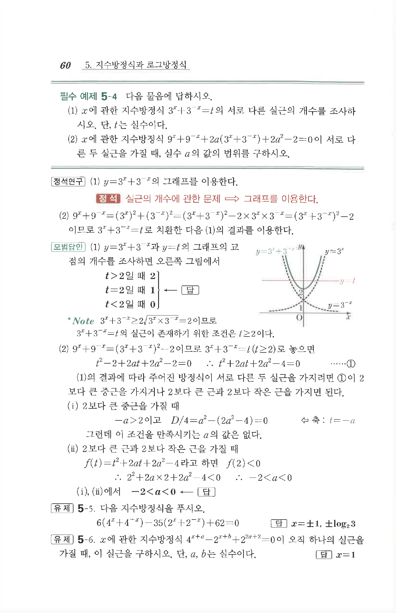

# 필수 예제 5-4

## 문제

다음 물음에 답하시오.

(1) $x$에 관한 지수방정식 $3^x+3^{-x}=t$의 서로 다른 실근의 개수를 조사하시오. 단, $t$는 실수이다.

(2) $x$에 관한 지수방정식 $9^x+9^{-x}+2a(3^x+3^{-x})+2a^2-2=0$이 서로 다른 두 실근을 가질 때, 실수 $a$의 값의 범위를 구하시오.

## 원문 문제

## 원문

