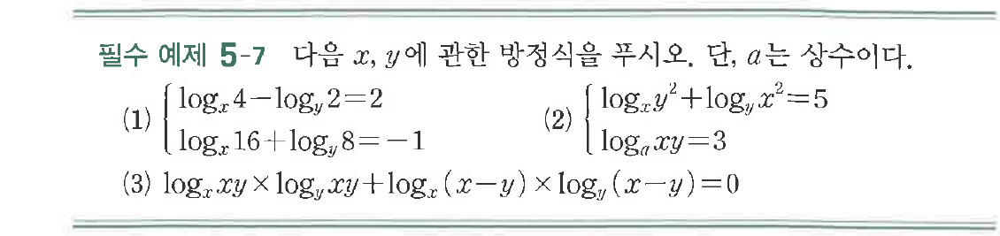

# 필수 예제 5-7

## 문제

다음 $x$, $y$에 관한 방정식을 푸시오. 단, $a$는 상수이다.

(1) $\begin{cases}\log_x 4-\log_y 2=2\\\log_x 16+\log_y 8=-1\end{cases}$

(2) $\begin{cases}\log_x y^2+\log_y x^2=5\\\log_a xy=3\end{cases}$

(3) $\log_x xy\times\log_y xy+\log_x(x-y)\times\log_y(x-y)=0$

## 원문 문제

## 원문

