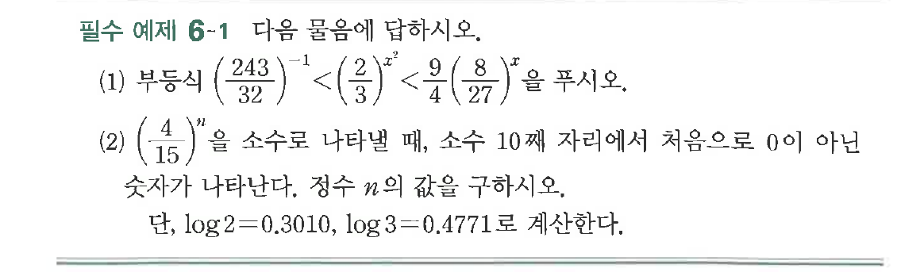
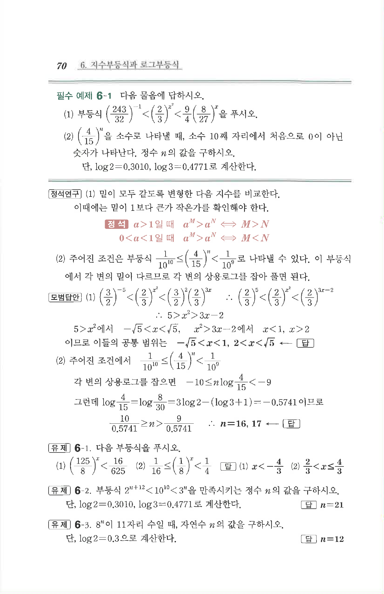

# 필수 예제 6-1

## 문제

다음 물음에 답하시오.

(1) 부등식 $\left(\dfrac{243}{32}\right)^{-1}<\left(\dfrac{2}{3}\right)^{x^2}<\dfrac{9}{4}\left(\dfrac{8}{27}\right)^x$을 푸시오.

(2) $\left(\dfrac{4}{15}\right)^n$을 소수로 나타낼 때, 소수 $10$째 자리에서 처음으로 $0$이 아닌 숫자가 나타난다. 정수 $n$의 값을 구하시오.

단, $\log 2=0.3010$, $\log 3=0.4771$로 계산한다.

## 원문 문제

## 원문

