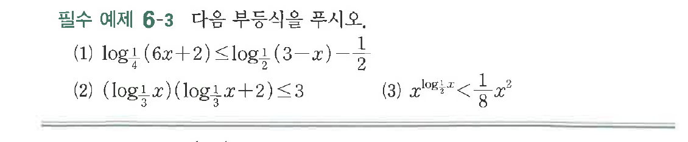
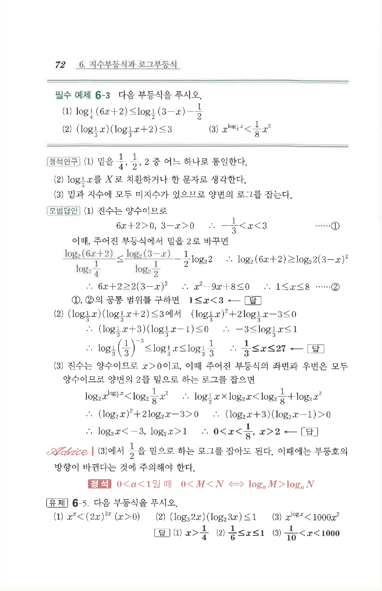

# 필수 예제 6-3

## 문제

다음 부등식을 푸시오.

(1) $\log_{\frac{1}{4}}(6x+2)\le \log_{\frac{1}{2}}(3-x)-\dfrac{1}{2}$

(2) $\left(\log_{\frac{1}{3}}x\right)\left(\log_{\frac{1}{3}}x+2\right)\le 3$

(3) $x^{\log_{\frac{1}{2}}x}<\dfrac{1}{8}x^2$

## 원문 문제

## 원문

