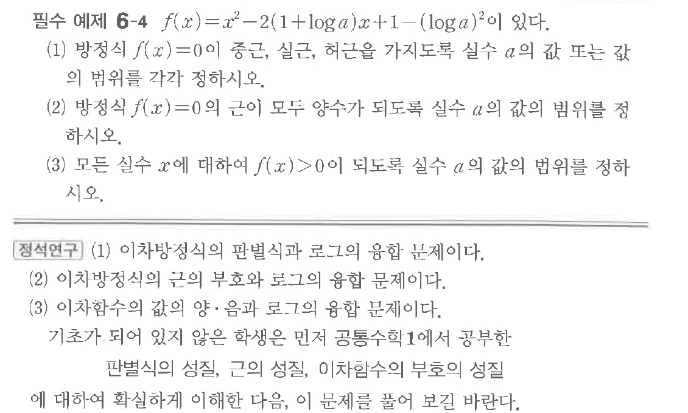
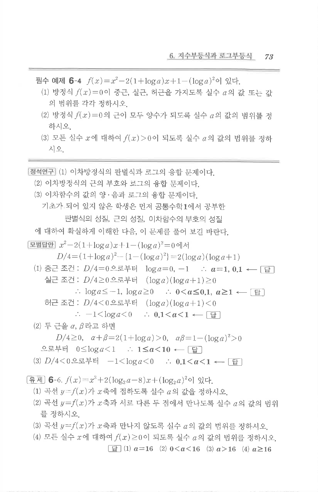

# 필수 예제 6-4

## 문제

$f(x)=x^2-2(1+\log a)x+1-(\log a)^2$이 있다.

(1) 방정식 $f(x)=0$이 중근, 실근, 허근을 가지도록 실수 $a$의 값 또는 값의 범위를 각각 정하시오.

(2) 방정식 $f(x)=0$의 근이 모두 양수가 되도록 실수 $a$의 값의 범위를 정하시오.

(3) 모든 실수 $x$에 대하여 $f(x)>0$이 되도록 실수 $a$의 값의 범위를 정하시오.

## 원문 문제

## 원문

