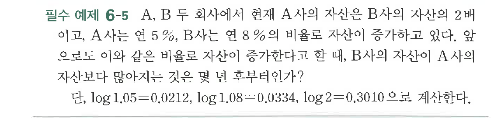

# 필수 예제 6-5

## 문제

$A$, $B$ 두 회사에서 현재 $A$사의 자산은 $B$사의 자산의 $2$배이고, $A$사는 연 $5\%$, $B$사는 연 $8\%$의 비율로 자산이 증가하고 있다. 앞으로도 이와 같은 비율로 자산이 증가한다고 할 때, $B$사의 자산이 $A$사의 자산보다 많아지는 것은 몇 년 후부터인가?

단, $\log 1.05=0.0212$, $\log 1.08=0.0334$, $\log 2=0.3010$으로 계산한다.

## 원문 문제

## 원문

