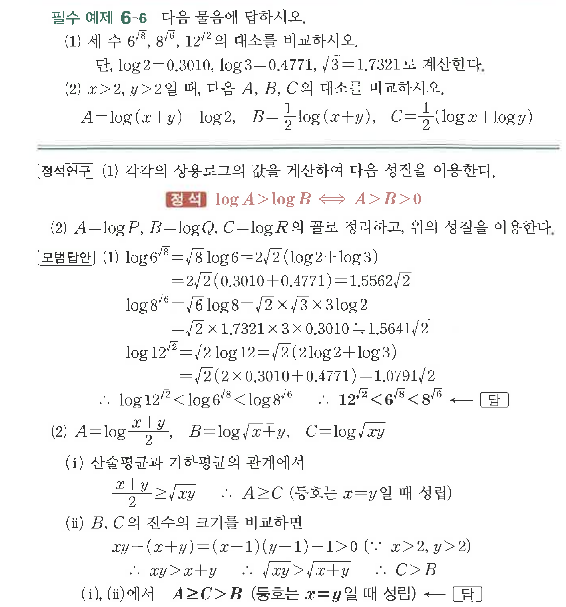
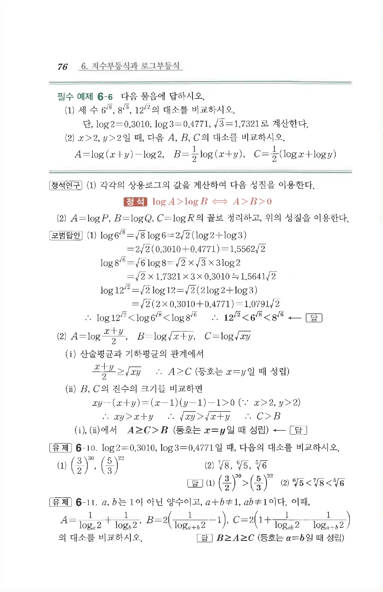

# 필수 예제 6-6

## 문제

다음 물음에 답하시오.

(1) 세 수 $6^{\sqrt{8}}$, $8^{\sqrt{6}}$, $12^{\sqrt{2}}$의 대소를 비교하시오.

단, $\log 2=0.3010$, $\log 3=0.4771$, $\sqrt{3}=1.7321$로 계산한다.

(2) $x>2$, $y>2$일 때, 다음 $A$, $B$, $C$의 대소를 비교하시오.

$$A=\log(x+y)-\log2,\quad B=\dfrac{1}{2}\log(x+y),\quad C=\dfrac{1}{2}(\log x+\log y)$$

## 원문 문제

## 원문

