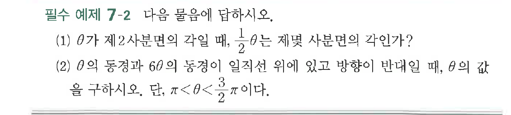

# 필수 예제 7-2

## 문제

다음 물음에 답하시오.

(1) $\theta$가 제$2$사분면의 각일 때, $\dfrac{1}{2}\theta$는 제몇 사분면의 각인가?

(2) $\theta$의 동경과 $6\theta$의 동경이 일직선 위에 있고 방향이 반대일 때, $\theta$의 값을 구하시오. 단, $\pi<\theta<\dfrac{3}{2}\pi$이다.

## 원문 문제

## 원문

