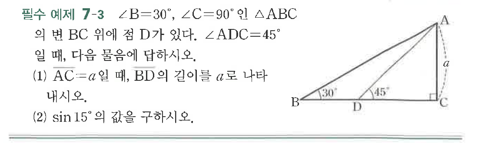

# 필수 예제 7-3

## 문제

$\angle B=30^\circ$, $\angle C=90^\circ$인 $\triangle ABC$의 변 $BC$ 위에 점 $D$가 있다. $\angle ADC=45^\circ$일 때, 다음 물음에 답하시오.

(1) $\overline{AC}=a$일 때, $\overline{BD}$의 길이를 $a$로 나타내시오.

(2) $\sin15^\circ$의 값을 구하시오.

## 원문 문제

## 원문

