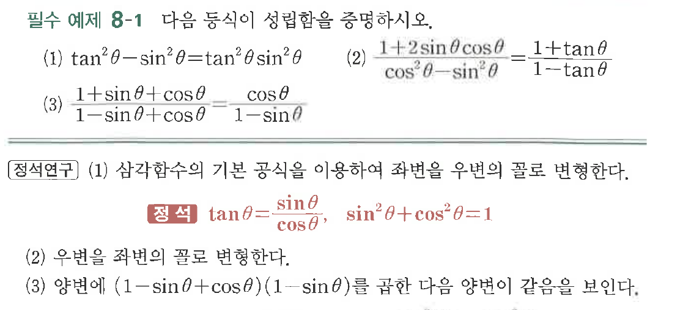

# 필수 예제 8-1

## 문제

다음 등식이 성립함을 증명하시오.

(1) $\tan^2\theta-\sin^2\theta=\tan^2\theta\sin^2\theta$

(2) $\dfrac{1+2\sin\theta\cos\theta}{\cos^2\theta-\sin^2\theta}=\dfrac{1+\tan\theta}{1-\tan\theta}$

(3) $\dfrac{1+\sin\theta+\cos\theta}{1-\sin\theta+\cos\theta}=\dfrac{\cos\theta}{1-\sin\theta}$

## 원문 문제

## 원문

