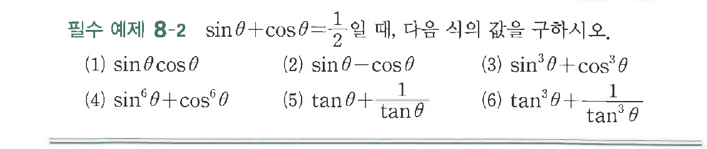
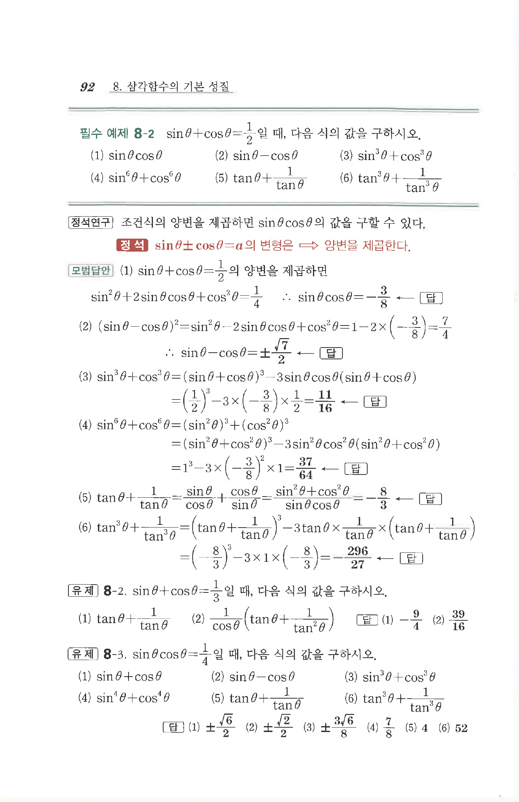

# 필수 예제 8-2

## 문제

$\sin\theta+\cos\theta=\dfrac{1}{2}$일 때, 다음 식의 값을 구하시오.

(1) $\sin\theta\cos\theta$

(2) $\sin\theta-\cos\theta$

(3) $\sin^3\theta+\cos^3\theta$

(4) $\sin^6\theta+\cos^6\theta$

(5) $\tan\theta+\dfrac{1}{\tan\theta}$

(6) $\tan^3\theta+\dfrac{1}{\tan^3\theta}$

## 원문 문제

## 원문

