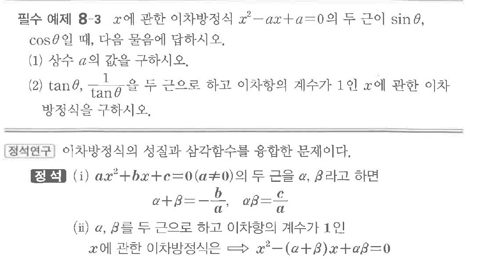

# 필수 예제 8-3

## 문제

$x$에 관한 이차방정식 $x^2-ax+a=0$의 두 근이 $\sin\theta$, $\cos\theta$일 때, 다음 물음에 답하시오.

(1) 상수 $a$의 값을 구하시오.

(2) $\tan\theta$, $\dfrac{1}{\tan\theta}$을 두 근으로 하고 이차항의 계수가 $1$인 $x$에 관한 이차방정식을 구하시오.

## 원문 문제

## 원문

