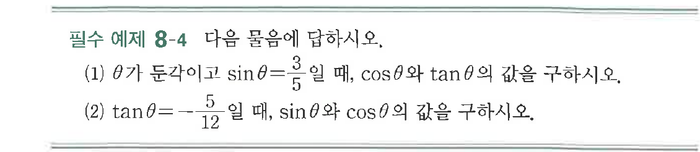

# 필수 예제 8-4

## 문제

다음 물음에 답하시오.

(1) $\theta$가 둔각이고 $\sin\theta=\dfrac{3}{5}$일 때, $\cos\theta$와 $\tan\theta$의 값을 구하시오.

(2) $\tan\theta=-\dfrac{5}{12}$일 때, $\sin\theta$와 $\cos\theta$의 값을 구하시오.

## 원문 문제

## 원문

