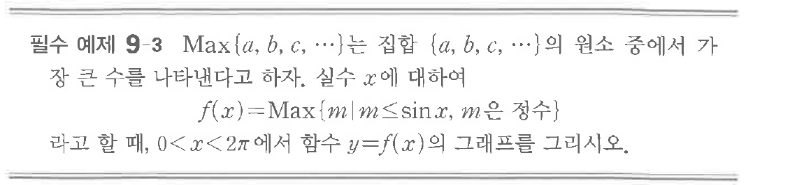

# 필수 예제 9-3

## 문제

$\operatorname{Max}\{a,b,c,\cdots\}$는 집합 $\{a,b,c,\cdots\}$의 원소 중에서 가장 큰 수를 나타낸다고 하자. 실수 $x$에 대하여

$$f(x)=\operatorname{Max}\{m\mid m\le \sin x,\ m\text{은 정수}\}$$

라고 할 때, $0<x<2\pi$에서 함수 $y=f(x)$의 그래프를 그리시오.

## 원문 문제

## 원문

